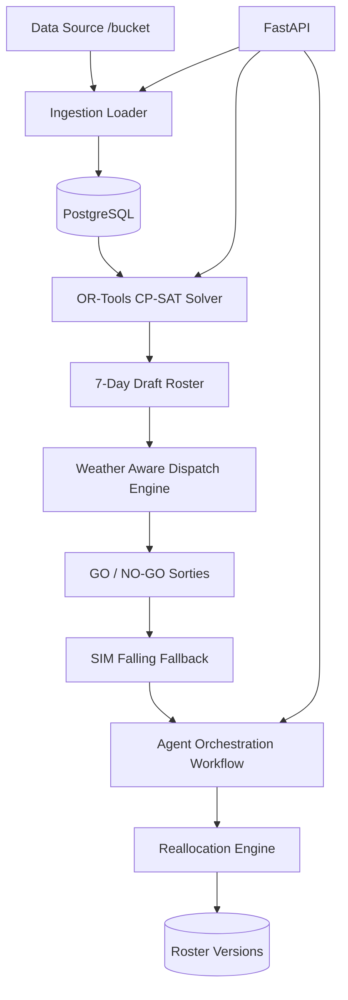

# ✈️ Aero Schedular AI Agent --- Dynamic Roster + Dispatch Engine

Aero Schedular AI Agent is a constraint-based scheduling and dispatch engine designed for flight training schools. Built with **OR-Tools CP-SAT**, **FastAPI**, and a custom **Micro-Graph Workflow**, it ensures 100% hard constraint safety and minimal churn during disruptions.

---

## 1. Architecture Diagram



---

## 2. Setup Instructions

### Prerequisites
- Python 3.9+
- Docker & Docker Compose
- PostgreSQL

### Local Installation
1. Clone the repository.
2. Install dependencies:
   ```bash
   pip install -r requirements.txt
   ```
3. Initialize the database:
   ```bash
   python -m app.init_db
   ```
4. Run full ingestion:
   ```bash
   python -m app.run_ingestion
   ```
5. Start the API:
   ```bash
   uvicorn app.api.main:app --reload
   ```

### Docker Deployment
```bash
docker-compose up --build
```

---

## 3. API Documentation & Sample Calls

### [POST] `/ingest/run`
Triggers full data ingestion from the `app/data` folder.

### [POST] `/roster/generate`
Generates the initial 7-day draft roster with dispatch decisions.
**Sample Response:**
```json
{
  "week_start": "2026-03-01",
  "base_icao": "VOBG",
  "roster": [...],
  "unassigned": []
}
```

### [POST] `/reallocate`
Handles a disruption event and recomputes the roster.
**Payload:**
```json
{
  "type": "AIRCRAFT_UNSERVICEABLE",
  "aircraft_id": "AC01",
  "from_day": "Mon",
  "to_day": "Tue"
}
```

### [GET] `/roster/versions`
Lists the audit trail of all roster versions and metrics.

### [GET] `/eval/run`
Runs the evaluation harness and returns performance metrics.

---

## 4. Tradeoffs & Design Decisions

### Why OR-Tools CP-SAT?
Instead of a greedy algorithm, we use **Constraint Programming**. This guarantees 100% safety (no double bookings, rating matches) and allows for global optimization.

### Objective Function & Weights
To satisfy the mandatory requirement for documented logic:
-   **Objective**: Maximize `sum(assignments)` (Total Volume).
-   **Weights**:
    -   Valid Assignment (Roster coverage): `1.0`
    -   Rule Violation: `-inf` (Hard constraint)
    -   Churn (in re-optimization): Weighted via "freeze" logic (preservation of state).

### Reallocation Stability (Churn Control)
The system uses "slot freezing." During a disruption, only the directly affected slots are released. This prevents "flicker" where a weather change in the morning causes an unrelated flight in the afternoon to be rescheduled.

### SimpleGraph vs LangGraph
Due to library-level DLL conflicts on certain Windows environments, we transitioned to a custom `SimpleGraph` implementation. This provides the same stateful orchestration benefits (assess → identify → propose → validate → commit) without the external dependency overhead.

---

## 5. Mandatory Documents
- [PLAN.md](PLAN.md) - Architectural roadmap
- [CUTS.md](CUTS.md) - Truncated features & scope decisions
- [POSTMORTEM.md](POSTMORTEM.md) - Challenges and lessons learned
- [.github/workflows/ci.yml](.github/workflows/ci.yml) - CI pipeline
